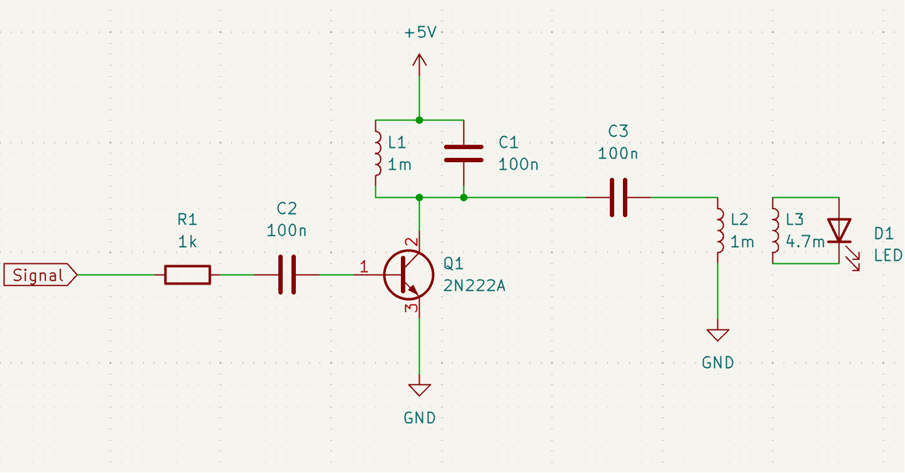
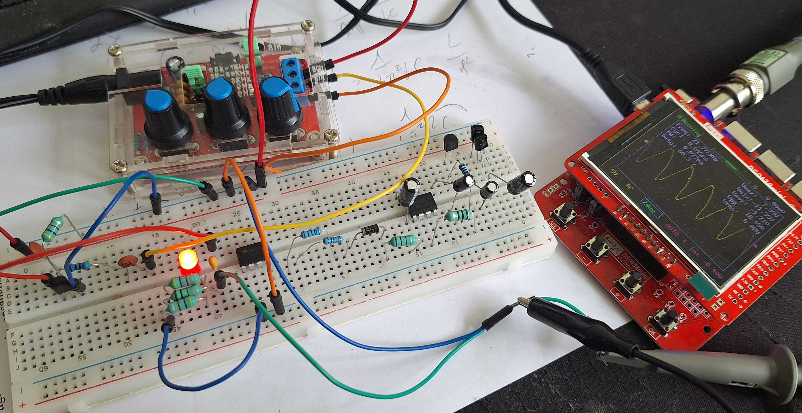

# LC_Tank
Built a simple LC Tank circuit for funsies, works fine with 5V and 9V supplies, resonates up to 20Vpp.
Used rf inductors, could optimize more with proper power inductors. Also used another inductor as an antenna to drive an LED LOL.

# Schematic

# In action

